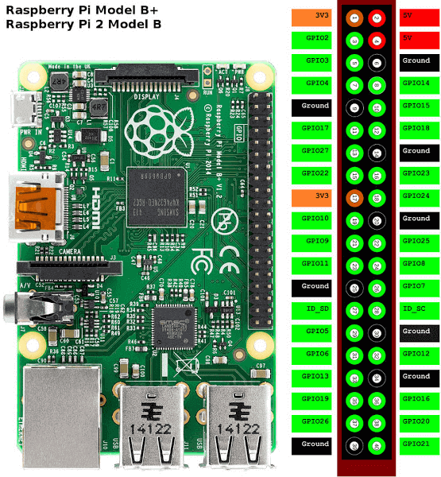

# RPI-433-Switch
Smart home switches using Amazon Echo and 433MHz RF switches

This is my setup for a smart outlet system using Raspberry Pi B+ and a set of RF outlet switches.
I have modified the fauxmo script from makermusings to fit my needs. I have also included the RFSniffer and codesend files from timleland's rfoutlet project for convenience. All credit goes to them for their great work on these scripts.

To set this up on your Pi, install git-core

    sudo apt-get install git-core

Then clone this repo

    git clone https://github.com/sachleen/RPI-433-Switch.git

The codes on line 388 of fauxmo.py will need to be changed depending on the output of RFSniffer.

Finally, execute either fauxmo or the run script to start it in debug mode.

    sh run.sh

Now, ask Alexa to `Find Connected Devices` and check the Alexa App to see that they're there.

Once everything is working, add this line to `/etc/rc.local` for startup at boot

    sudo python /home/pi/Desktop/RPI-433-Switch/fauxmo.py &

[Etekcity Wireless Remote Control Electrical Outlet Switch](https://www.amazon.com/gp/product/B00DQELHBS)

The transmitter and receiver are connected to these pins on the Pi:
TX pin: GPIO17, wiring pin 0
RX pin: GPIO 27

[Raspberry PI 2 Model B/B+ Pinout](https://jpralves.net/post/2016/11/15/raspberry-pi.html)

Resources:

* [How to Control Power Outlets Wirelessly Using the Raspberry Pi](https://www.samkear.com/hardware/control-power-outlets-wirelessly-raspberry-pi)
* [Control 433Mhz Rf power outlets from a Raspberry Pi - timleland](https://github.com/timleland/rfoutlet)
* [Emulated Belkin WeMo devices that work with the Amazon Echo - makermusings](https://github.com/makermusings/fauxmo)